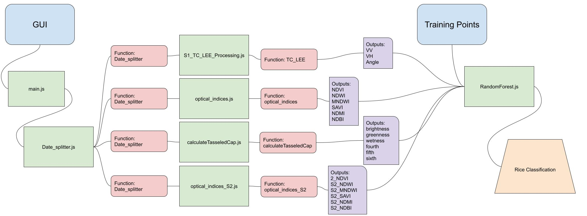

# Rice_Extent_Mapper

Rice_Extent_Mapper GEE Tool

A Javascript tool set that utilizes the 
GEE platform to automatically construct phenologcally 
relivant indices as feature inouts for a Random Forest
modeling framework to delinate rice area. This use case is built for the kingdom of Bhutan.

The [Rice_Mapper_Extent_Example Script](https://code.earthengine.google.com/75456bbf8826c460bcbf9316ec4c3d95) is a working example that uses all of the indidvual modules to produce a Rice classification
