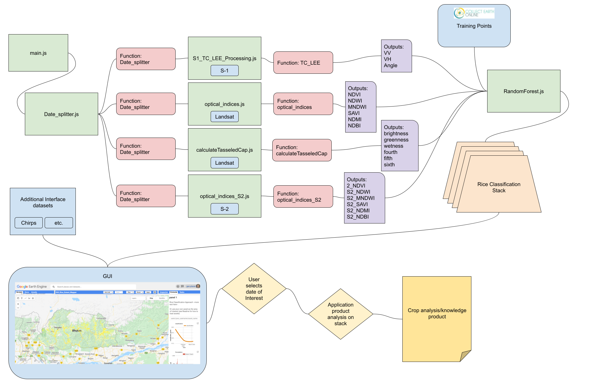

# Rice_Extent_Mapper

Rice_Extent_Mapper GEE Tool

A Javascript tool set that utilizes the 
GEE platform to automatically construct phenologcally 
relivant indices as feature inouts for a Random Forest
modeling framework to delinate rice area. This use case is built for the kingdom of Bhutan.
#
The [Rice_Mapper_Extent_Example Script](https://code.earthengine.google.com/922ab930c8e63d175bc48f70e773c357) is a working example that uses all of the individual modules to produce a Rice classification
#
Example Graphical User Interface GEE application to display analyize rice classified images: [GUI_Rice_Extent_Mapper](https://code.earthengine.google.com/5814fc8fb6183dae5bff5e707f2ac4de)

#

